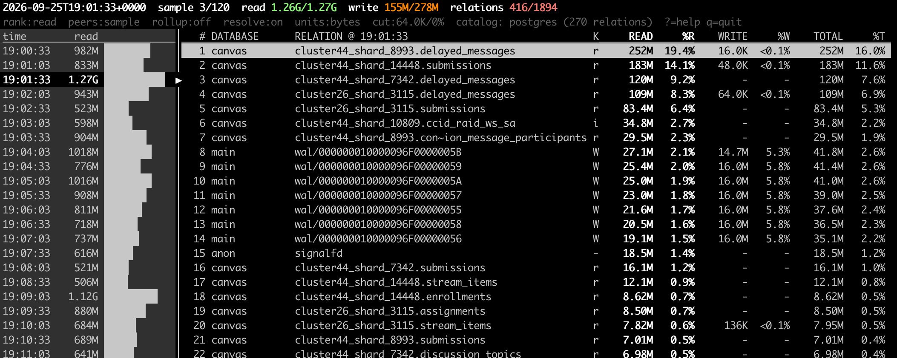
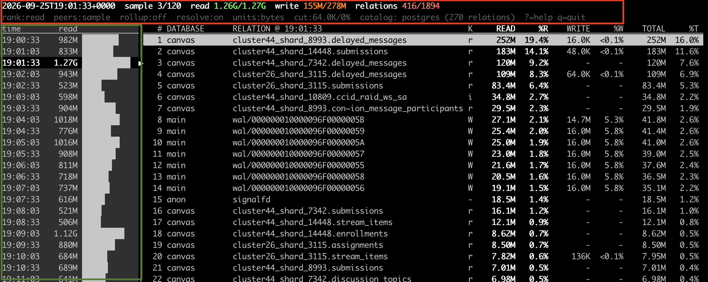

# VFS Piggies
(or, how to know which PostgreSQL relation was consuming all your disk i/o in the past)

# Why
Let's say you have a PostgreSQL database.
Let's say you monitor this database.
Let's say your monitoring shows a massive burst of reads last night, right before your CPU hit the roof and your connections spiked and your query time exploded.
A reasonable DBA might look at that and say, "it sure looks like something blew out my cache."
Now let's say that DBA goes to the slow query log and tries to identify *which* query was to blame.
But let's say there are hundreds of distinct query patterns at the time of those reads, and they're touching tables all over the place. Nothing was *obviously* terrible but most of those queries were in the hundreds of milliseconds.

How do you know where to focus your investigation?

Enter VFS Piggies.

# How
Virtual filesystem statistics are are gathered continually in a very cheap manner and stored on disk. On the rare times you want to read that data, a lot more work happens to present it to you in a usable fashion.

## The Monitor
The Linux eBPF framework is used to tap into read and write activity from postgres processes.
1. Because it's eBPF, it needs to run as root:
`sudo /usr/local/bin/postgres_vfs_activity_ebpf_monitor > file`
2. You can run it however you want; in a harness that deals with file rotation is a perfectly reasonable thing to do. All the monitor does is output a chunk of activity every 30 seconds to stdout.
3. Output is very basic, just a database and a file:
```2026-09-25 21:00:03 UTC g   @rbytes[16766, 40361.7]: 2646016
2026-09-25 21:00:03 UTC g   @rbytes[16766, 40361.13]: 2670592
2026-09-25 21:00:03 UTC g   @rbytes[16766, 40361.6]: 3301376
2026-09-25 21:00:03 UTC g   @rbytes[16766, 40361.5]: 3538944
2026-09-25 21:00:03 UTC g   @wbytes[16766, 65384]: 8192
2026-09-25 21:00:03 UTC g   @wbytes[16766, 117547001]: 8192
2026-09-25 21:00:03 UTC g   @wbytes[16766, 117552019]: 8192
2026-09-25 21:00:03 UTC g   @wbytes[16766, 66454]: 8192
2026-09-25 21:00:03 UTC g   @wbytes[16766, 117566625]: 8192
2026-09-25 21:00:03 UTC g   @wbytes[16766, 65951]: 8192
2026-09-25 21:00:03 UTC g   @wbytes[16766, 117555392]: 8192
2026-09-25 21:00:03 UTC g   @wbytes[16766, 69713]: 8192
```

 ## The Reader
That output is cheap to gather but it's terrible for a human. Most of this project is about the reader script, whose job it is to parse those 30 second samples and present them in a meaningful way. It has a usage screen you can access with `-h` or `--help` but you can also just run it by doing:

`read_vfs_activity.py <file>`

Yes, that is the same file the monitor has been writing to.

It takes inspiration from info-dense ncurses apps of yore, like iotop, and looks like this:

 

There's a lot going on here so let's take it by parts.

### The Layout
The reader's layout is broken into 3 main sections.



* The top two lines (inside the red box) show some statistics of the current sample time, and the config knobs the reader is currently employing.
* The left side of the screen (inside the green box) shows the sample times available in the file the reader.
* The right side of the screen (everything else) shows all the activity that happened *for the selected sample time.* In this particular example, all this activity data we are seeing applies to the `19:01:33` sample time.

### Useful features
* **Help**. The '?' brings up an overlay showing all the keys you can use. Use the help. It is helpful.
* **Cutoffs**. Each sample time captures all the files with i/o, but honestly, who cares if a relation only got a few KB of activity? By default, the reader hides objects with less than 64KB of activity. You can see this on the second line with the `cut` knob. 

  You can also see how much of an impact this is making    on the top line, which shows overall stats for the       sample period. For example:
  `read 1.26G/1.27G  write 155M/278M  relations 416/1894`
  means, "416 relations generated more than the cutoff     level of IO, out of 1894 files that generated *any*      amount of IO in this time sample, and those 416 files    sum to have 1.26GB reads out of 1.27GB total and 155MB   writes out of 278MB total."
  
  When the cutoff has made little impact, the number is    shown in green; a medium impact in orange, and a large   impact is shown in red.
* **Histograms**. Each sample time on the left shows both the time and the amount of activity, but honestly numbers can blur together and it can be annoying to figure out where to focus. Human brains like pictures, so to the right of the numeric activity is a histogram showing how this time period compares to others in the file in terms of activity. The shorter the bar, the relative less activity happened in that window.
* **Object rollups**. By default the reader rolls up activity for a given table, so all indices, toast tables, and forks show up as if they were accesses for the actual table. Want to see the real breakdown? Type `o`, and the activity for these related relations are split out into independent objects. (The `relation` count on the top line grows as you would expect.)
* **Rank by mode**. `w` to rank by writes, `r` to rank by reads, `t` to rank by total activity. This changes the histogram too.
* **Focus mode**. Scroll up and down between the relations; if you want to focus on one and see how it compares over all the time samples, just hit `Enter`. All other relations are hidden, but you can still see where your focused relation ranks for each time sample. `Esc` to exit focus mode.
* **Regex search**. `/` to filter relations by regex.

